# PCV-3D

#### 介绍
A Method for Combining Point Cloud and Video Data to Build 3D Realistic Models

#### Software Architecture
VS2016 | PCL 1.12.1 | CGAL 5.3.1

**Main Idea**
Use RANSAC plane fitting to find the plane equation

Calculate the farthest and nearest points

Calculate the front and back plane equations based on the farthest and nearest points and the plane equation

Use non-coplanar planes to find the intersection point

#### Installation

CMake is required for all

1.  Environment Installation (Windows)

[win10+vs2019+pcl1.11.0 Installation Tutorial](./doc/win10+vs2019+pcl1.11.0.md)

Configure environment variables

```
# New environment variables
PCL_ROOT=G:\PCL 1.12.1
BOOST_ROOT=G:\PCL 1.12.1\3rdParty\Boost
QHULL_BIN=G:\PCL 1.12.1\3rdParty\Qhull\bin
CGAL_DIR=G:\CGAL-5.3.1
GMP_LIBRARY=G:\CGAL-5.3.1\auxiliary\gmp\lib

# Environment variables in PATH
%PCL_ROOT%\bin
%PCL_ROOT%\3rdParty\VTK\bin
%PCL_ROOT%\3rdParty\Boost\lib
%PCL_ROOT%\3rdParty\FLANN\lib
%PCL_ROOT%\3rdParty\OpenNI2\Redist
%CGAL_DIR%\auxiliary\gmp\lib
%QHULL_BIN%
```

2.  Environment Installation(ubuntu)

   Install PCL、gmp、mpfr
```
 sudo apt-get install libpcl-dev libgmp-dev libmpfr-dev
```

  Install CGAL-5.3.1
```
wget https://github.com/CGAL/cgal/releases/download/v5.3.1/CGAL-5.3.1.tar.xz
tar -xvf CGAL-5.3.1.tar.xz
```

Configure environment variables

Edit profile
```
vi /etc/profile
```

Add environment variables
```
CGAL_DIR=/root/CGAL-5.3.1
GMP_LIBRARY=$CGAL_DIR/auxiliary/gmp/lib
PATH=$PATH:$GMP_LIBRARY
export PATH CGAL_DIRY
```

Update environment variables
```
source /etc/profile
```
Note: If it doesn’t work, restart and check if the environment variables are configured correctly

#### Usage Instructions

1. Start the project in release x64Configure props to start as per the [tutorial](./doc/win10+vs2019+pcl1.11.0.md)

2. CMake method (command)

   ```
   cd PCLTest
   mkdir build && cd build
   cmake -DCGAL_DIR=/root/CGAL-5.3.1 -DCMAKE_BUILD_TYPE=Debug ..
   make
   ```
   
3. CMake method (cmake-gui)

Set the source code path and the compiled path

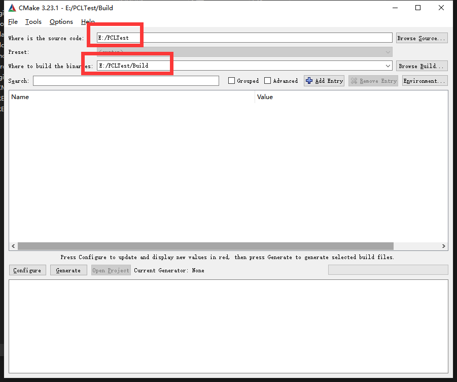

Click Configure, select the VS version and architecture

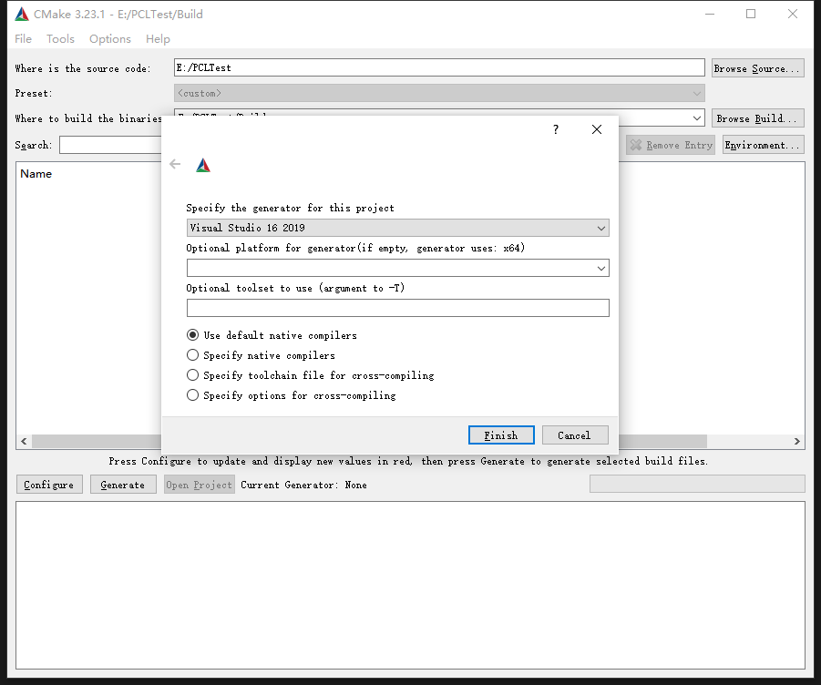

Click Generate to create the VS project

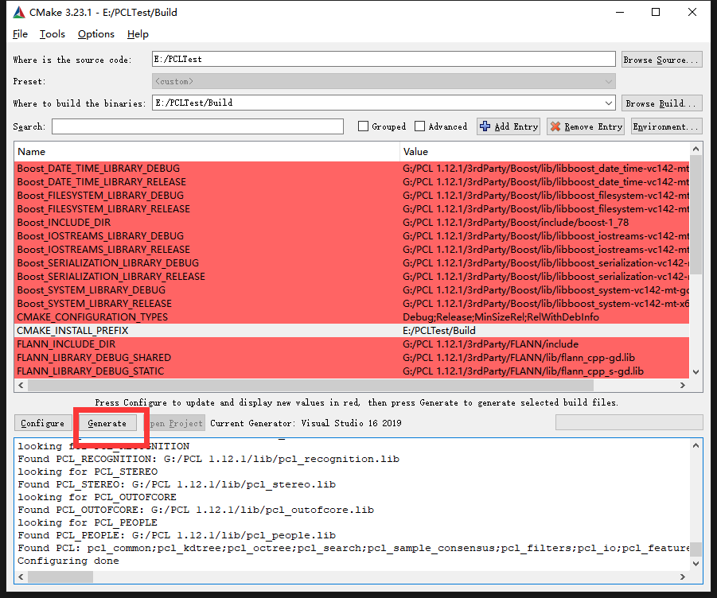

Finally, open “ALL_BUILD” in VS to generate

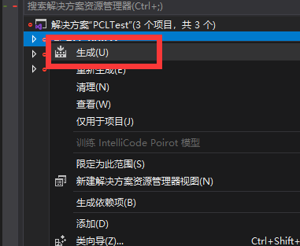

!!! Set PCLTest as the startup item !!!

Error corrections:
1.Macro definitions are invalid

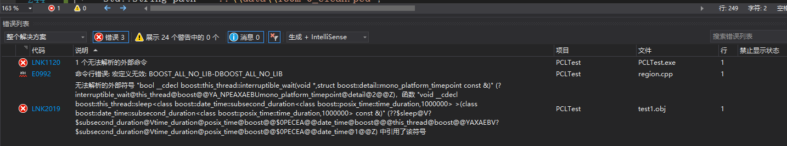

Modify the PCLTest properties -> C/C++ -> Preprocessor -> Preprocessor definitions to:

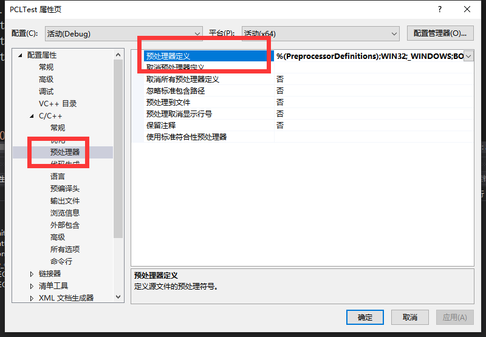

```
BOOST_USE_WINDOWS_H
NOMINMAX
_CRT_SECURE_NO_DEPRECATE
```
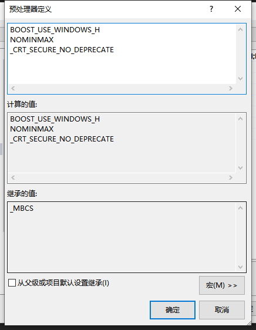

2.LNK1104: unable to open file“libboost_thread-vc142-mt-gd-x64-1_78.lib”

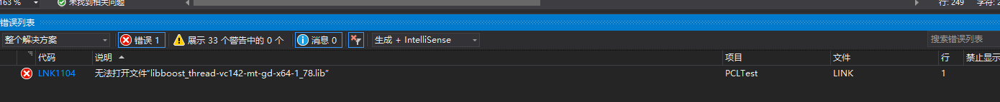

Modify the PCLTest properties -> VC++ directories -> Library directories to the Boost/lib under PCL:

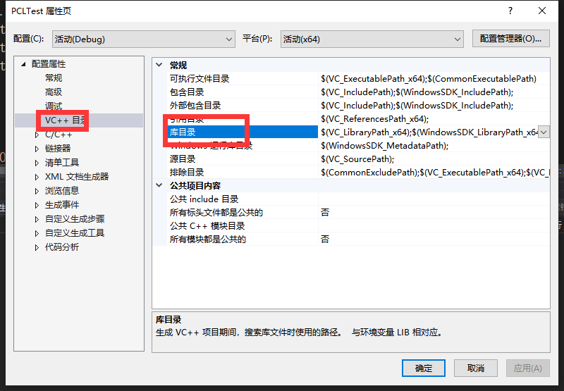

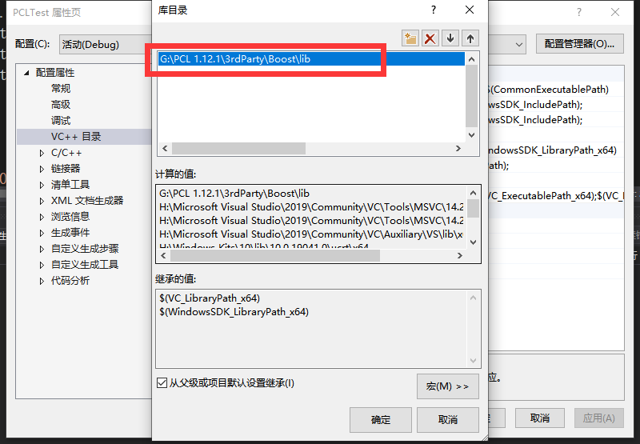

3.C2001 error: newline in constant (often occurs in std::cout)

Method 1: C/C++ -> All Options -> Additional Options Input:
```
/utf-8 %(AdditionalOptions)
```
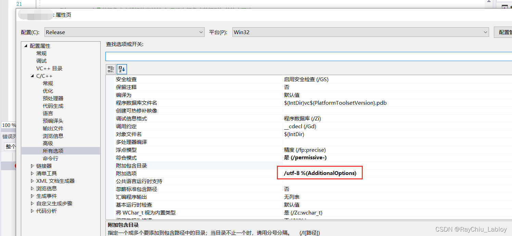

Method 2: Save the error file as UTF-8 encoding

4.Missing qhull_rd.dll during compilation

Find the file and put it into the debug folder at the PCL installation path \3rdParty\Qhull\bin\qhull_rd.dll

#### Contributing

Fork this repository
Create a new Feat_xxx branch
Commit your code
Create a new Pull Request