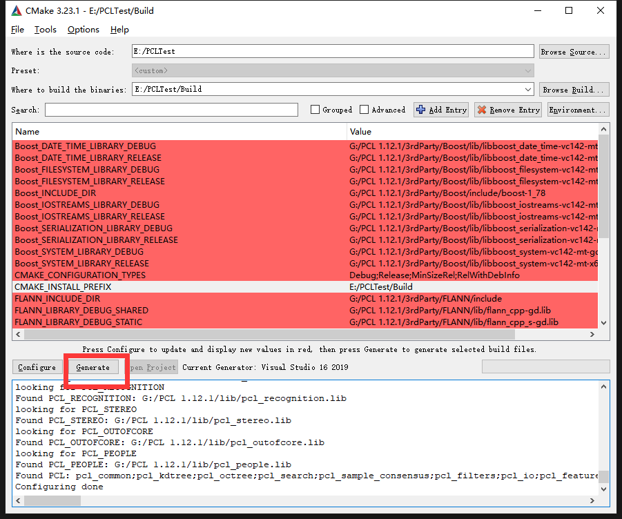
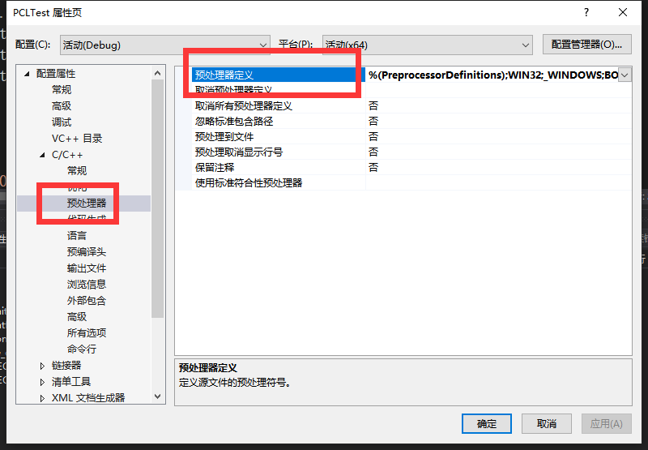
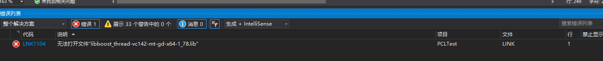
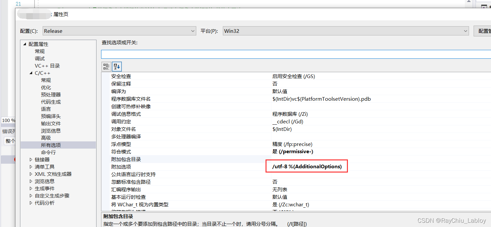

# PCV-3D

#### 介绍
A Method for Combining Point Cloud and Video Data to Build 3D Realistic Models

#### 软件架构
VS2016 | PCL 1.12.1 | CGAL 5.3.1

**主要思路**

通过ransac平面拟合求平面方程

计算最远最近点

根据最远最近点和平面方程计算前后平面方程

使用不共线平面求交点

#### 安装教程

前提都需要安装CMake

1.  环境安装(Windows)

[win10+vs2019+pcl1.11.0安装教程](./doc/win10+vs2019+pcl1.11.0.md)

配置环境变量

```
# 新建的环境变量
PCL_ROOT=G:\PCL 1.12.1
BOOST_ROOT=G:\PCL 1.12.1\3rdParty\Boost
QHULL_BIN=G:\PCL 1.12.1\3rdParty\Qhull\bin
CGAL_DIR=G:\CGAL-5.3.1
GMP_LIBRARY=G:\CGAL-5.3.1\auxiliary\gmp\lib

# path中的环境变量
%PCL_ROOT%\bin
%PCL_ROOT%\3rdParty\VTK\bin
%PCL_ROOT%\3rdParty\Boost\lib
%PCL_ROOT%\3rdParty\FLANN\lib
%PCL_ROOT%\3rdParty\OpenNI2\Redist
%CGAL_DIR%\auxiliary\gmp\lib
%QHULL_BIN%
```

2.  环境安装(ubuntu)

   安装PCL、gmp、mpfr
```
 sudo apt-get install libpcl-dev libgmp-dev libmpfr-dev
```

  安装CGAL-5.3.1
```
wget https://github.com/CGAL/cgal/releases/download/v5.3.1/CGAL-5.3.1.tar.xz
tar -xvf CGAL-5.3.1.tar.xz
```

配置环境变量

编辑profile
```
vi /etc/profile
```

添加环境变量
```
CGAL_DIR=/root/CGAL-5.3.1
GMP_LIBRARY=$CGAL_DIR/auxiliary/gmp/lib
PATH=$PATH:$GMP_LIBRARY
export PATH CGAL_DIRY
```

更新环境变量
```
source /etc/profile
```
注意：不起作用重启一下, 检查环境变量是否配置正确

#### 使用说明

1. release x64 启动项目

​       [教程](./doc/win10+vs2019+pcl1.11.0.md)中的方式配置props启动

1. Cmake方式(命令)

   ```
   cd PCLTest
   mkdir build && cd build
   cmake -DCGAL_DIR=/root/CGAL-5.3.1 -DCMAKE_BUILD_TYPE=Debug ..
   make
   ```
   
2. Cmake方式(cmake-gui)

设置源码路径和编译后路径


点击Configure，选择vs版本和架构


点击Generate生成VS项目



最后VS打开 “ALL_BUILD”生成


！！！PCLTest设为启动项！！！

错误修改：
1.宏定义无效


PCLTest属性->C/C++->预处理器->预处理器定义修改为：



```
BOOST_USE_WINDOWS_H
NOMINMAX
_CRT_SECURE_NO_DEPRECATE
```


2.LNK1104: 无法打开文件“libboost_thread-vc142-mt-gd-x64-1_78.lib”



PCLTest属性->VC++目录->库目录，修改为PCL下的Boost/lib：


3.C2001错误 常量中有换行符(常出现在std::cout)

方式一：C/C++->所有选项->附加选项输入：
```
/utf-8 %(AdditionalOptions)
```


方式二：报错文件另存为UTF-8编码

4.编译时出现缺失 qhull_rd.dll

找到文件放进debuge文件夹
pcl安装路径\3rdParty\Qhull\bin\qhull_rd.dll

#### 参与贡献

1.  Fork 本仓库
2.  新建 Feat_xxx 分支
3.  提交代码
4.  新建 Pull Request