看pointnet论文的时候发现有点云的可视化，但里面的可视化好像是基于CAD做的，正好最近我在用c++处理一些点云数据，就想着怎么直接把点云显示出来,就找到了PCL库，与opencv类似，opencv是处理图像的库，pcl是处理点云的库，封装了很多实用的函数，以下是基于win10+vs2019环境下pcl环境的搭建。

# pcl库的下载与安装 

## 下载 

我下载的vs版本是vs2019,pcl下载的当前最新的版本pcl1.11.0，正好与vs2019对应。  
pcl链接: [pcl-1.11.0][].

下载两个文件：  
PCL-1.11.0-AllInOne-msvc2019-win64.exe  
pcl-1.11.0-pdb-msvc2019-win64.zip

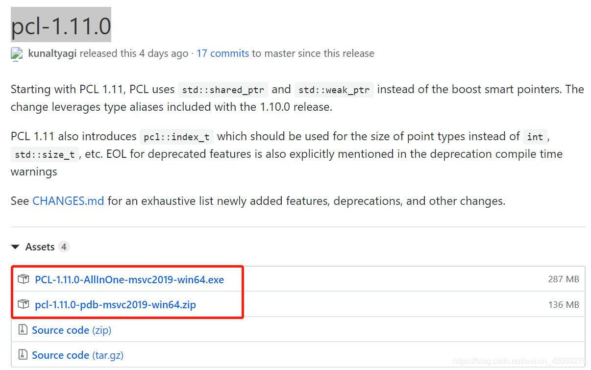

## 安装 

双击“PCL-1.9.0-AllInOne-msvc2017-win64.exe”进行安装，点击下一步，出现下图界面时，选择“Add PCL to the system PATH for all users”，自动把路径添加到系统环境变量中。  
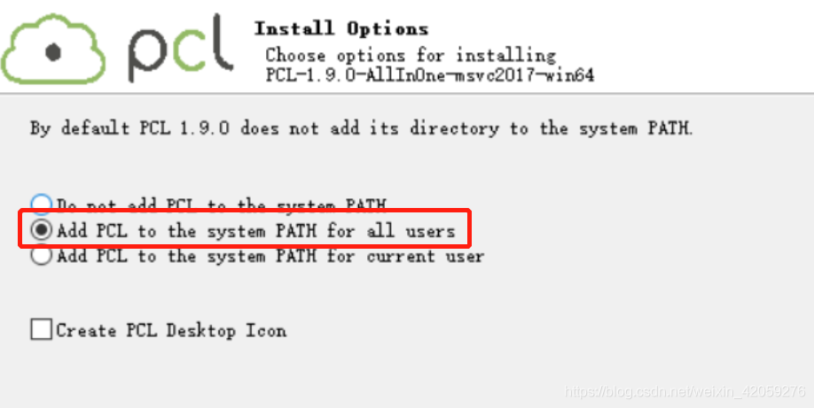  
选择安装路径的时候默认C盘，我改到了D盘，其他的默认就行了。  
安装到最后的时候会弹出安装OpenNI的提示，此时也会选择安装路径，默认是C盘。但此前安装已经在pcl的安装目录下的3rdParty文件夹中已经有了空的OpenNI2文件夹，建议将OpenNI安装路径改到此文件夹下，即安装路径为“D:\\programming\\PCL 1.11.0\\3rdParty\\OpenNI2”  
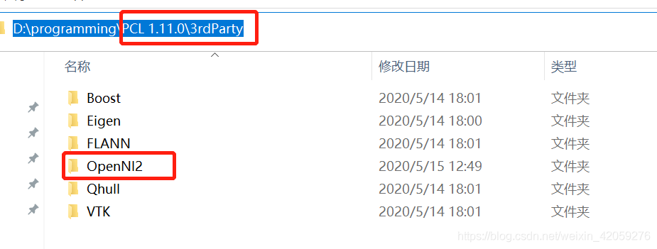  
解压“pcl-1.11.0-pdb-msvc2019-win64.zip”，将解压得到的文件夹中的内容添加“…\\PCL 1.11.0\\bin”中。  
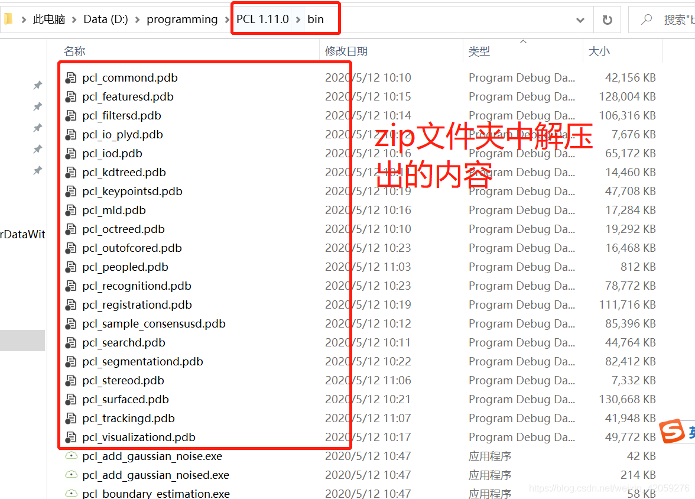  
pcl库安装完成，接下来配置环境变量，在系统环境变量中，由于勾选了自动添加路径，可以看到以下两个路径已经添加了进来：  
D:\\programming\\PCL 1.11.0\\bin  
D:\\programming\\PCL 1.11.0\\3rdParty\\VTK\\bin  
我又手动添加了一个：  
D:\\programming\\PCL 1.11.0\\3rdParty\\OpenNI2\\Redist  
否则后面可能会报错“由于找不到OpenNI2.dll,无法继续执行代码。重新安装程序可能会解决此问题”。  
配置完环境变量后，重启电脑即可生效。  
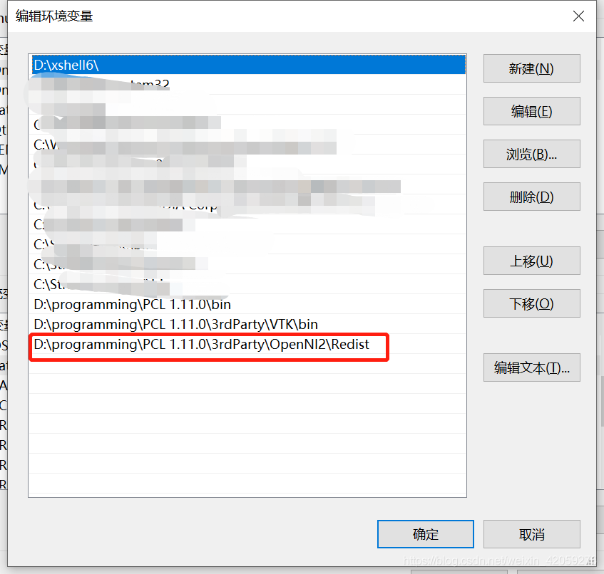

# vs2019中配置pcl1.11.0 

在VS中新建一个空项目，编译环境改为X64，Release版本。  
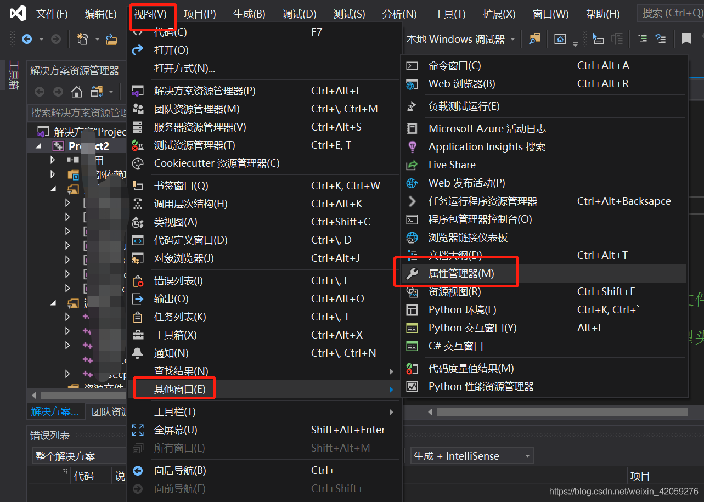  
视图->其他窗口->属性管理器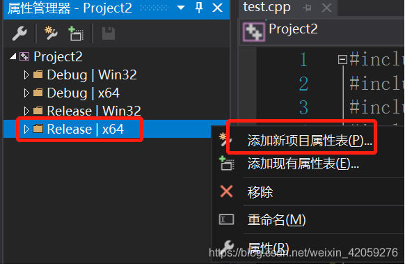  
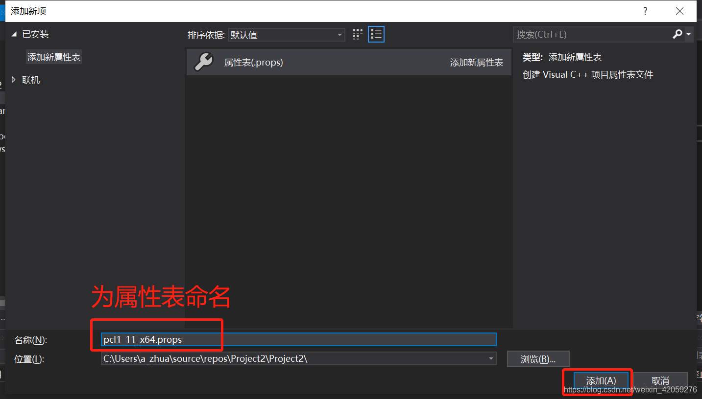  
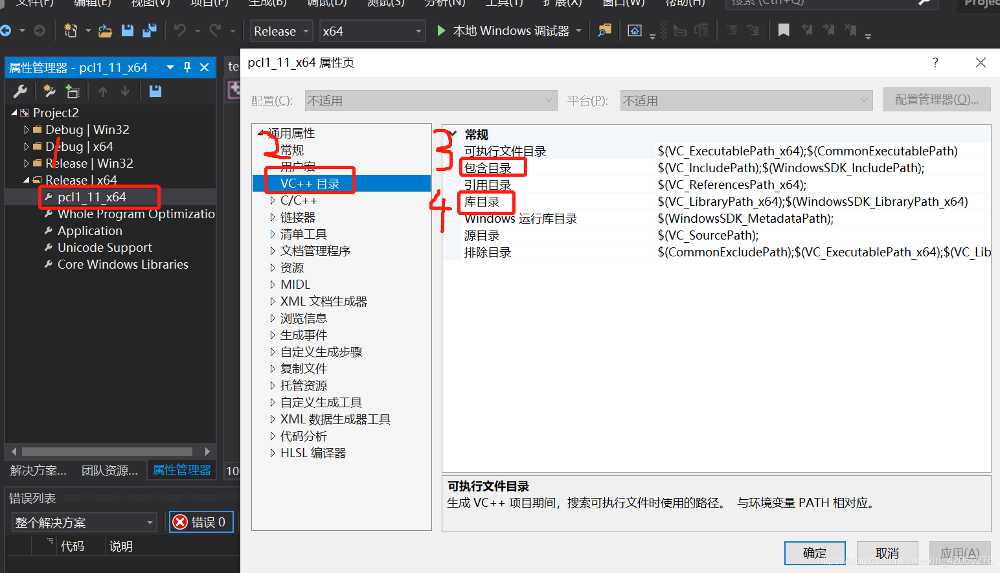    
vc++目录->包含目录 中添加以下7个目录：  
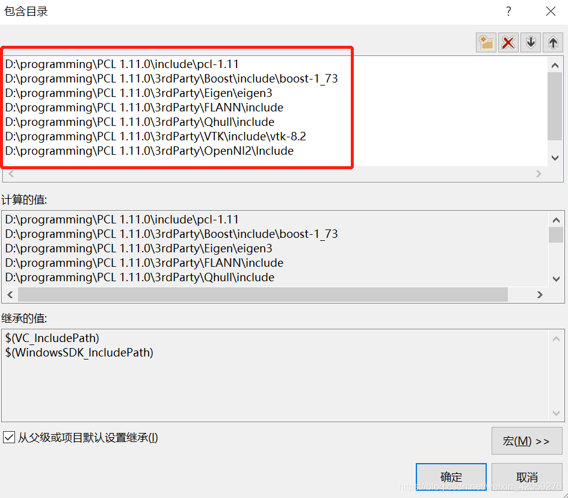  
直接复制时请注意版本和路径以及名称，建议手动添加

```java
D:\programming\PCL 1.11.0\include\pcl-1.11
D:\programming\PCL 1.11.0\3rdParty\Boost\include\boost-1_73
D:\programming\PCL 1.11.0\3rdParty\Eigen\eigen3
D:\programming\PCL 1.11.0\3rdParty\FLANN\include
D:\programming\PCL 1.11.0\3rdParty\Qhull\include
D:\programming\PCL 1.11.0\3rdParty\VTK\include\vtk-8.2
D:\programming\PCL 1.11.0\3rdParty\OpenNI2\Include
```

vc++目录->库目录 中添加以下6个目录：  
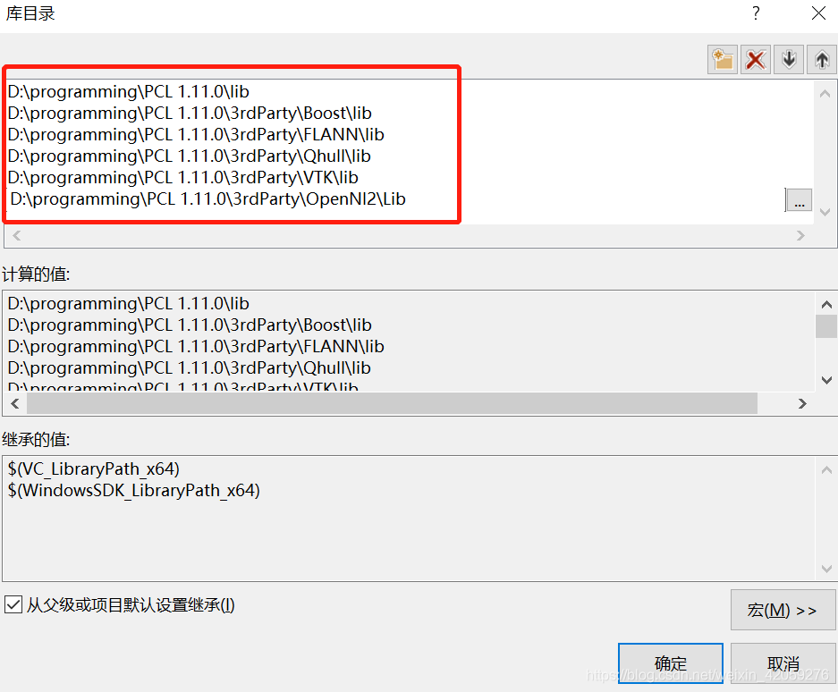  
直接复制时请注意版本和路径以及名称，建议手动添加

```java
D:\programming\PCL 1.11.0\lib
D:\programming\PCL 1.11.0\3rdParty\Boost\lib
D:\programming\PCL 1.11.0\3rdParty\FLANN\lib
D:\programming\PCL 1.11.0\3rdParty\Qhull\lib
D:\programming\PCL 1.11.0\3rdParty\VTK\lib
D:\programming\PCL 1.11.0\3rdParty\OpenNI2\Lib
```

C/C++—>预处理器—>预处理器定义  
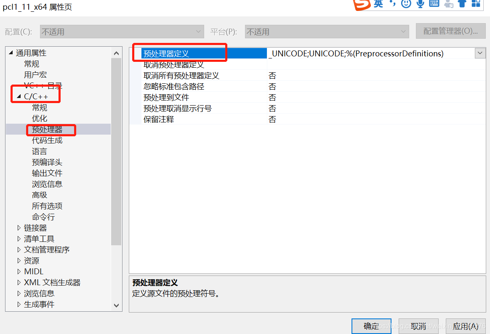  

```java
BOOST_USE_WINDOWS_H
NOMINMAX
_CRT_SECURE_NO_DEPRECATE
```

C/C++ ->所有选项->SDL检查 改为否。  
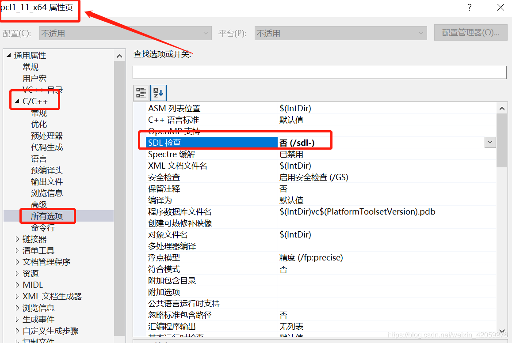  
上面这个是在属性页里改的，最好在项目属性里，也把SDL检查改为“否”，不加下面这一步有的时候会报错。  
项目->属性->C/C++ ->所有选项->SDL检查  
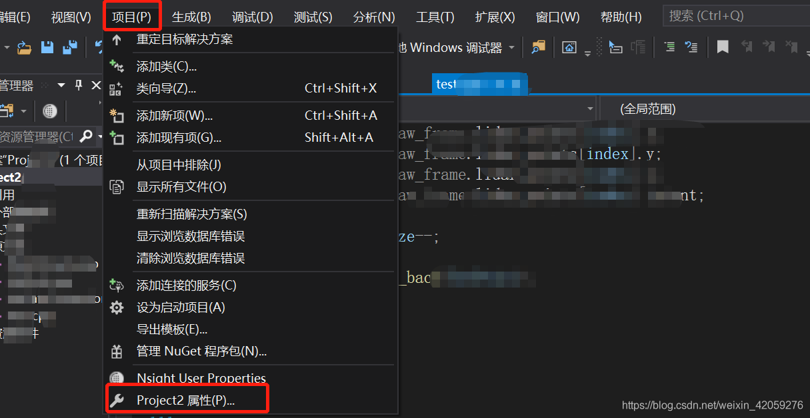  
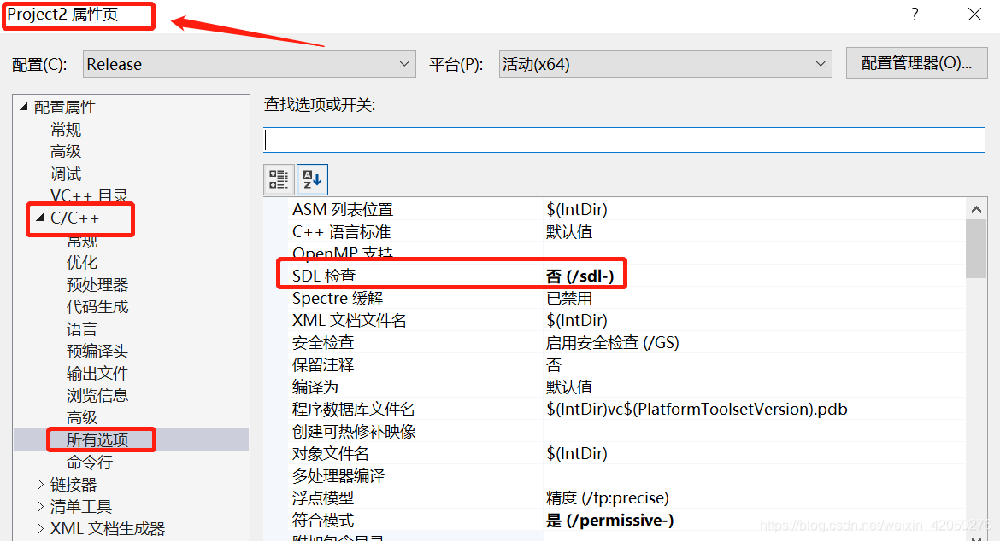

链接器—>输入—>附加的依赖项

将PCL 1.11.0\\3rdParty\\VTK\\lib和PCL 1.11.0\\lib这两个文件夹下的lib文件的release版本添加到附加依赖项中  
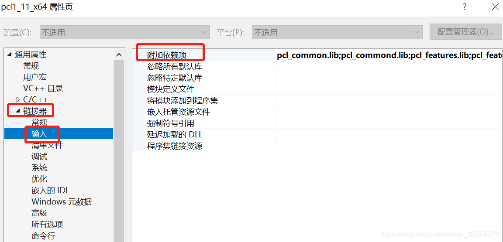  
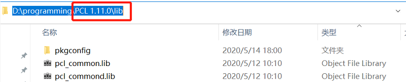  
为了方便，通过批处理把文件夹中的文件名写入到一个txt中：

```java
//win+r调出“运行”窗口并输出cmd
//（填自己的路径）
cd /d D:\programming\PCL 1.11.0\lib 
dir /b *.lib *>0.txt
```

注意，这个0.txt中会把0.txt和一个pkgconfig文件夹也写进去，复制到附加依赖项之前，应该把这两个删掉，否则会报错  
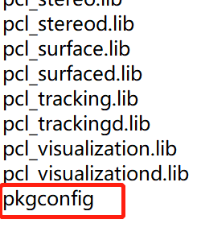  
  
现在该txt中包含了release和debug两种版本的库，如下图，需要将release版本单独分离出来，对于相同功能的库，两个版本是挨着的，可以用程序把他们分别写到两个txt中。  
分离程序：[https://blog.csdn.net/weixin\_41991128/article/details/83965051][https_blog.csdn.net_weixin_41991128_article_details_83965051]  
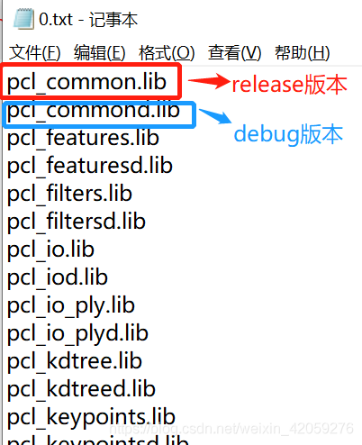)

使用程序分离后的release版本：将该txt内容复制到vs的附加依赖项中  
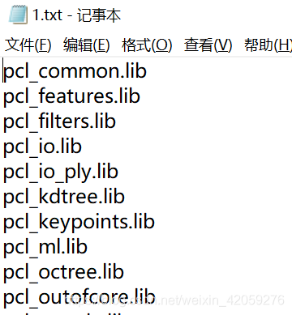

使用程序分离后的debug版本，暂不使用。  
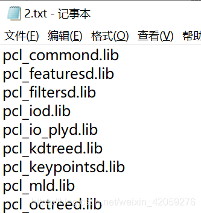  
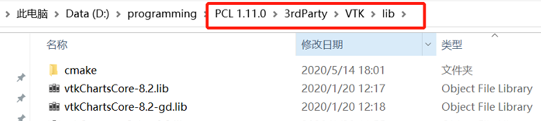

```java
//win+r调出“运行”窗口并输出cmd
//（填自己的路径）
cd /d D:\programming\PCL 1.11.0\3rdParty\VTK\lib
dir /b *.lib *>1.txt
```

同上，把1.txt和cmake删掉。  
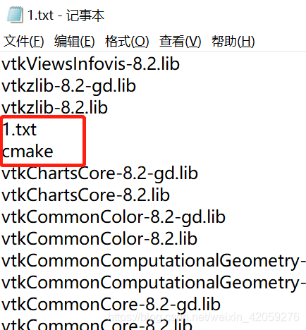  
同上，该txt中也包含了release和debug两种版本的库，如下图，需要将release版本单独分离出来，对于相同功能的库，两个版本是挨着的，可以用程序把他们分别写到两个txt中。  
分离程序：[https://blog.csdn.net/weixin\_41991128/article/details/83965051][https_blog.csdn.net_weixin_41991128_article_details_83965051]  
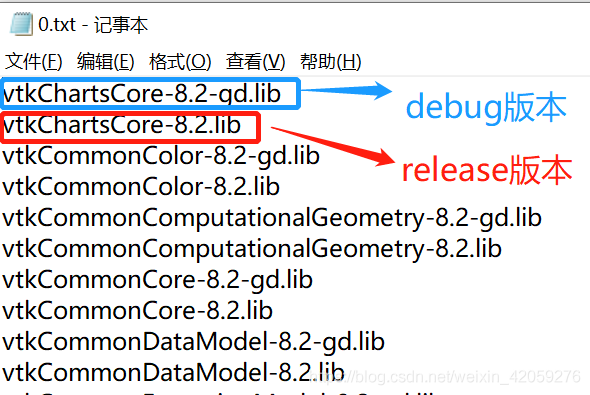  
使用程序分离后的release版本：将该txt内容复制到vs的附加依赖项中  
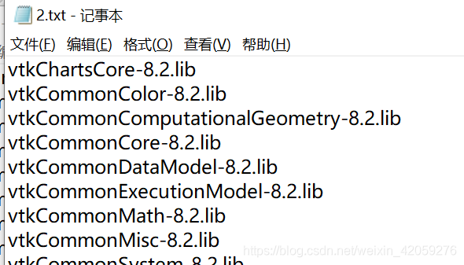  
使用程序分离后的debug版本，暂不使用。  
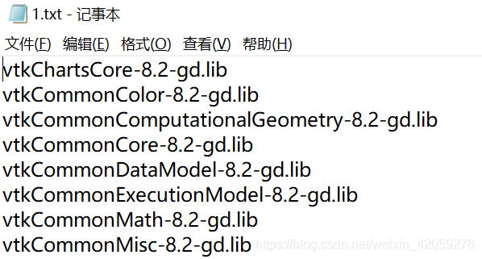  
配置完成。

# 测试pcl库是否安装成功 

```java
#include <iostream>
#include <pcl/io/pcd_io.h>
#include <pcl/point_types.h>
int  main (int argc, char** argv)
{ 
    pcl::PointCloud<pcl::PointXYZ> cloud;   // Fill in the cloud data  
    cloud.width    = 5;  
    cloud.height   = 1;  
    cloud.is_dense = false;  
    cloud.points.resize (cloud.width * cloud.height);  
    for (std::size_t i = 0; i < cloud.points.size (); ++i) 
    {    
        cloud.points[i].x = 1024 * rand () / (RAND_MAX + 1.0f);    
        cloud.points[i].y = 1024 * rand () / (RAND_MAX + 1.0f);    
        cloud.points[i].z = 1024 * rand () / (RAND_MAX + 1.0f);
    }  
        pcl::io::savePCDFileASCII ("test_pcd.pcd", cloud);  
        std::cerr << "Saved " << cloud.points.size () << " data points to test_pcd.pcd." << std::endl;  
        for (std::size_t i = 0; i < cloud.points.size (); ++i)    
             std::cerr << "    " << cloud.points[i].x << " " << cloud.points[i].y << " " << cloud.points[i].z << std::endl;  
        return (0);
}
```

输出下图（数字可能不同），则表示安装成功！  
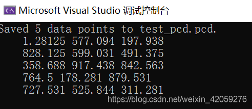


[pcl-1.11.0]: https://github.com/PointCloudLibrary/pcl/releases
[https_blog.csdn.net_weixin_41991128_article_details_83965051]: https://blog.csdn.net/weixin_41991128/article/details/83965051